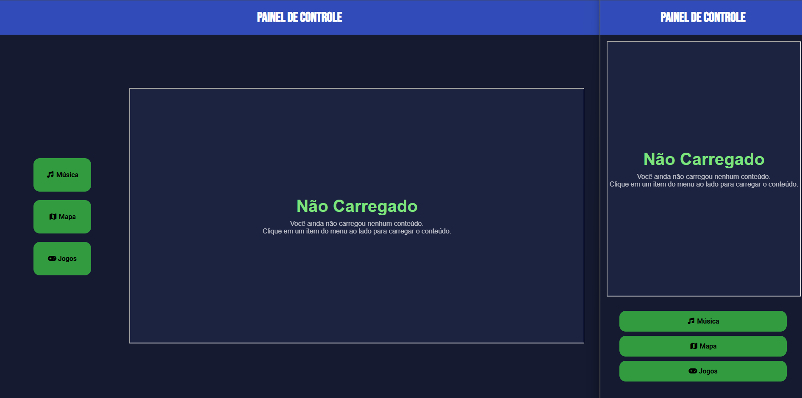
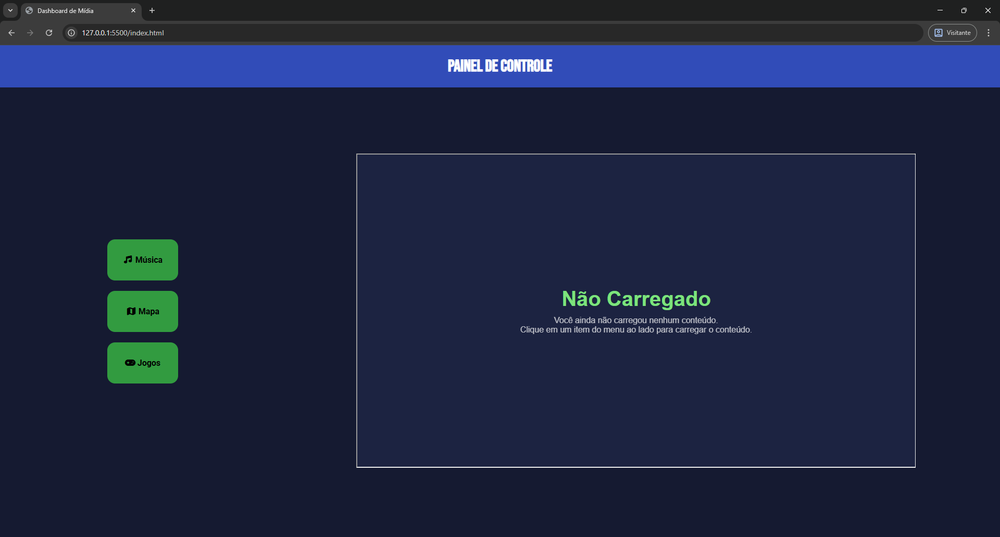
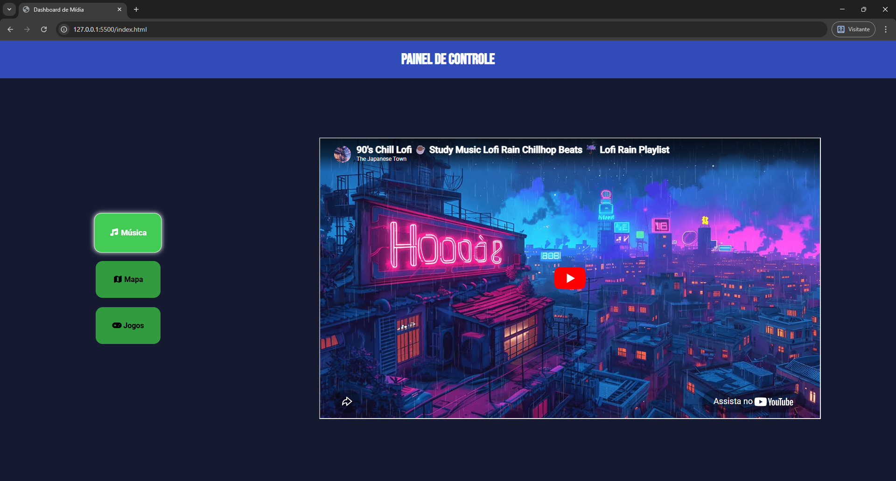
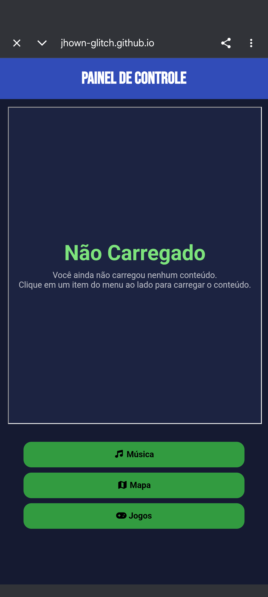
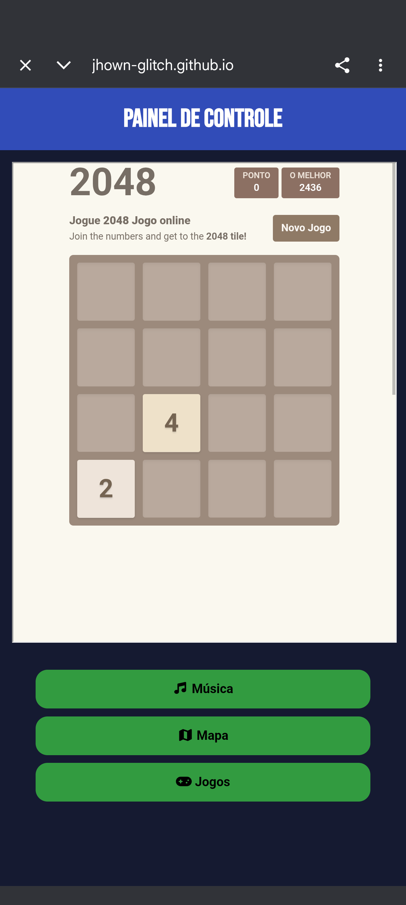

# 📺 Dashboard de Mídia - Hub de Vibes

Este é um projeto de um painel de controle interativo desenvolvido durante os meus estudos no **Módulo 4 do curso de HTML5 e CSS3 do Curso em Vídeo (Prof. Gustavo Guanabara)**. O objetivo foi criar uma interface centralizada para carregar diferentes conteúdos multimédia (YouTube, Mapas, Jogo) utilizando `iframes`.

## 🚀 Funcionalidades
- **Navegação Lateral:** Menu com botões interativos para troca de conteúdo.
- **Integração de Iframe:** Carregamento dinâmico de vídeos e mapas sem recarregar a página.
- **Responsividade Total:** Layout adaptável para PC (Desktop) e dispositivos móveis (Portrait).
- **Design Moderno:** Uso de variáveis CSS, Flexbox e efeitos de profundidade com `box-shadow`.

## 🛠️ Tecnologias Utilizadas
- **HTML5:** Estrutura semântica.
- **CSS3:** Estilização avançada, Media Queries e Flexbox.
- **Font Awesome:** Ícones para a interface.
- **Google Fonts:** Tipografia selecionada (Bebas Neue e Roboto).

## 💡 Aprendizados Técnicos
Durante este projeto, superei alguns desafios técnicos interessantes:
- **Resolução de Conexão Recusada em Iframes:** Aprendi a utilizar as URLs de *embed* corretas para contornar restrições de segurança (X-Frame-Options).
- **Especificidade de Seletores:** Implementação de efeitos visuais no estado `:focus` e `:active` utilizando a estrutura de links em volta de itens de lista (`a:focus li`).
- **Layout Adaptativo:** Uso de `flex-direction: column-reverse` para mover o menu de navegação para a base da tela em dispositivos móveis, melhorando a experiência do usuário (UX).

## 📸 Preview

#### Versão Lado a Lado

#### Versão Desktop

#### Versão Mobile

---
Projeto desenvolvido para fins didáticos. 
Inspirado pelas aulas do mestre Gustavo Guanabara. 🖖